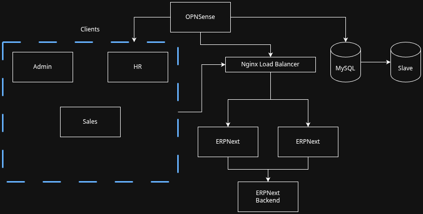

# ERP Project 

## Why did we choose this project? 
Me and Sameer chose this project in order to understand what enterprises need in order to imlement and design a cost effective system to track products and stock. We understood that the database is the most important component within the system, so we used a dual redundancy system.

## Steps taken to ensure redundancy and scalability

* We made the choice to use a Dynamic Load Balancer using the resource based algorithm, as it would save on resources. We chose this over the other options due to the fact that it will save on resources and network traffic by sending requests to the server with least load. This was ideal over other choices because:
    - **Least Connection**: This assumes that all requests take the same amount of compute power, which isnt true for an ERP system as some requests can require adding to a database or deleting.
    - **Weighted Least Connection**:  